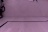

# END-TO-END self-driving using raspberry pi

## Final video

## Procedure

### Making training data

* Made image scale of 48x32 using raspberry pi camera. 

### Training model

* Made image gray to scale down the data and the model.
* Used CNN to train the model.

### Streming the data to the raspberry pi

* I've tried to use the model to decide direction but the model was too heavy for Pi to run it.
* So I decided to receive the camera image from the Pi to my laptop and run the model in my laptop then send the decision to the Pi.
* It has reduced the decision making time 1/10 from 0.3s to 0.03s.

